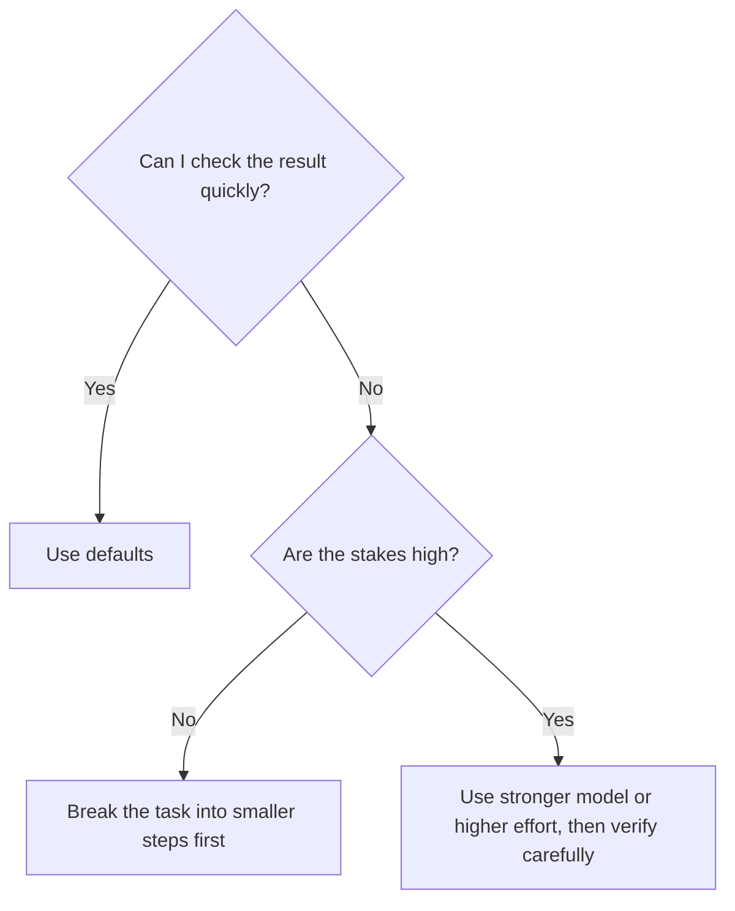

Claude Code has two practical dials: **model** and **effort**. Together, they control the trade-off between speed, usage, and reasoning depth.

<Note>
  **The simple version:** leave these alone until you have a reason not to. The defaults are good for most beginner work.
</Note>

## Where the controls are

In the desktop app, the model and effort controls sit near the lower-right corner of the Code session.

The exact model names available to you can change by plan and over time. Do not memorize them. Use the picker in your app as the source of truth.

## What the model controls

A model is the underlying Claude brain doing the work. In plain English:

| Model choice | What you are trading |
|---|---|
| Faster / lighter model | Quicker responses and lighter usage |
| Default model | Best everyday balance |
| Stronger / heavier model | Better for harder tasks, usually slower and heavier on usage |

Most beginner tasks sit comfortably in the default lane: cleaning a spreadsheet, summarizing PDFs, organizing files, drafting a short memo, or building a tiny calculator.

## What effort controls

Effort is how hard Claude thinks before answering. Higher effort can help when the task is ambiguous, complex, or high stakes. It can also make simple tasks slower.

Use higher effort when:

- The result affects money, clients, legal terms, or a public deliverable.
- The input is messy and full of edge cases.
- Claude needs to compare many files or reconcile conflicting facts.
- You have already tried once and the answer was shallow or wrong.

Use normal/default effort when:

- You are exploring.
- You need a quick first pass.
- The task is easy to check.

## A beginner rule of thumb

Do not use model choice as a substitute for verification. A stronger model can still make a wrong assumption.

## What to say

You can let Claude recommend the setting:

> This task is important and a bit messy. Tell me whether the current model and effort are appropriate before you start.

Or:

> This is a quick cleanup. Use the fastest reasonable setting unless accuracy would suffer.

## The cost angle

On a normal paid Claude plan, you are not paying per message in the beginner sense, but plans still have usage limits. Stronger models, higher effort, and sprawling tasks use more of that allowance.

That does not mean you should be scared to use them. It means you should match the setting to the task.

## Next

<CardGroup cols={2}>
  <Card title="Subagents & Plugins" icon="puzzle-piece" href="/agentic-ai/claude-code/best-practices/subagents-and-plugins">
    When one task benefits from multiple passes
  </Card>
  <Card title="Managing Cost & Context" icon="gauge" href="/agentic-ai/claude-code/best-practices/cost-and-context">
    Keep sessions focused and efficient
  </Card>
</CardGroup>
