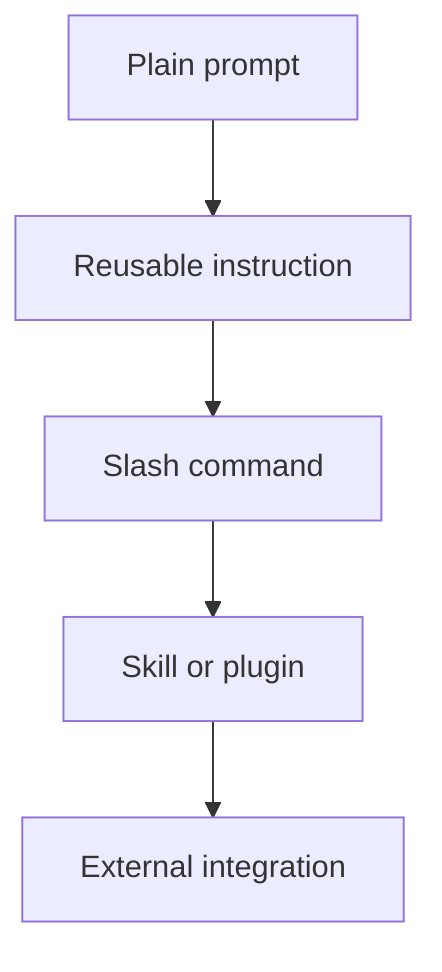

You do not need subagents or plugins to get started. But they are worth understanding early because they explain why Claude Code can feel much more capable than a normal chatbot.

The simple version:

- **Subagents** let Claude split work into smaller jobs.
- **Plugins and tools** give Claude new abilities.
- **You still stay in charge** of the goal, permissions, and final review.

## Subagents: helpers for separate slices of work

A subagent is a helper Claude can use for a focused part of a larger task. Instead of one conversation trying to hold everything at once, Claude can split the work.

Example:

> Review these ten vendor proposals. Have one pass extract prices, another pass extract contract terms, and a final pass reconcile the comparison table.

You do not need to configure anything for that beginner-level use. Just ask for the workflow in plain English:

> Break this into separate passes, then combine the results and tell me what disagreed.

That is the beginner mental model: **separate passes for separate questions.**

## When subagents help

Use the idea when the task has natural lanes:

- One pass extracts facts; another checks them.
- One pass summarizes each document; another compares across documents.
- One pass proposes a plan; another looks for risks.
- One pass cleans data; another verifies row counts and totals.

Do not use it for tiny tasks. If you only need one number or one rename, one Claude is enough.

## Plugins: extra capabilities

Plugins are packages of extra functionality Claude can use. A plugin might add tools, workflows, integrations, or specialized instructions.

The beginner question is not "how do plugins work internally?" It is:

> Do I need Claude to do something it cannot currently do with the files in this folder?

If yes, a plugin may eventually be the right path. If no, keep working with plain files and plain English.

## A useful hierarchy

Start at the top. Move down only when you repeat the same work enough that saving the workflow is worth it.

## What beginners should avoid for now

Hooks and detailed MCP setup are real parts of the ecosystem, but they are not beginner material. They add power by wiring Claude into events and outside systems. That also means more ways to surprise yourself.

For this guide, the useful beginner architecture is enough:

| Concept | Beginner meaning |
|---|---|
| **Subagent** | A helper pass for one slice of a bigger job |
| **Plugin** | Extra abilities Claude can use when plain files are not enough |
| **Skill** | Reusable know-how for a repeated task |
| **Slash command** | A saved prompt you can trigger quickly |

## A safe first prompt

Try this before reaching for configuration:

> This task has several parts. Propose whether you would handle it as one pass or multiple specialist passes. Do not start yet.

That gets the benefit of the architecture without forcing you to learn the machinery first.

## Next

<CardGroup cols={2}>
  <Card title="Start the Projects" icon="list-check" href="/agentic-ai/claude-code/first-projects/csv-to-chart">
    Put the habits to work — clean a spreadsheet, organize files, build a tool, then a forecasting model
  </Card>
  <Card title="Going Further" icon="rocket" href="/agentic-ai/claude-code/going-further">
    Memory files, slash commands, skills, and plugins
  </Card>
</CardGroup>
