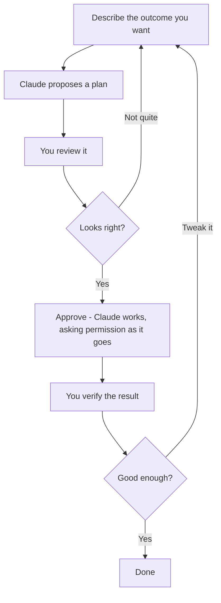

Claude Code is a **loop**, not a vending machine. You don't drop in a coin and walk away — you work *with* it, in a back-and-forth that takes a few rounds. Once this rhythm feels natural, everything else in this guide is just detail.

## The loop at a glance

## The five beats

<Steps>
  <Step title="Describe what you want">
    Tell Claude the **outcome** you're after, in plain English — the way you'd brief a capable new analyst. Focus on the result, not the technical steps.

    > Clean up `sales.csv` — remove duplicate rows and fix the inconsistent dates — then give me total revenue by month as a table and a bar chart.
  </Step>
  <Step title="Let it plan before it acts">
    For anything beyond a trivial ask, have Claude lay out its plan *first*: which files it'll touch, what it intends to do. You read the plan before any action happens. This is your cheapest chance to catch a misunderstanding — and it's the single best habit a beginner can build.
  </Step>
  <Step title="Review what it's about to do">
    As Claude works, it will pause and **ask permission** before doing things that matter — running a command, editing a file, creating something new. You'll see a prompt. Read it, then approve or redirect. (More on these prompts just below.)
  </Step>
  <Step title="Approve — or push back">
    If the plan looks right, approve and let it run. If something looks off, just say so in plain English: *"Don't overwrite the original — save the cleaned version as a new file."* Claude adjusts and continues.
  </Step>
  <Step title="Verify the result yourself">
    When Claude says it's done, **check the work.** Open the chart. Spot-check a couple of numbers. "It ran without errors" is not the same as "it's correct." This matters enough that it gets [its own page](/agentic-ai/claude-code/best-practices/reviewing-and-verifying).
  </Step>
</Steps>

Then you **iterate**: "Actually, make the chart by quarter instead." The loop goes around again. Most real tasks take two or three laps — that's normal and expected, not a sign you did it wrong.

## Understanding permission prompts

The first time Claude wants to *do* something — not just talk — it asks. A prompt pops up along the lines of "Claude wants to run this" or "Claude wants to edit this file," and you choose how to respond.

| Your choice | What it means | When to use it |
|---|---|---|
| **Allow once** | Approve just this one action | Default while you're learning — stay in the loop |
| **Allow always** (for this kind of action) | Stop asking for this type of thing in this project | Once you trust a repetitive, safe action |
| **No / reject** | Don't do it; tell Claude what to do instead | Whenever something looks wrong |

<Tip>
  While you're new, prefer **Allow once**. Yes, it's more clicks — but watching each action go by is exactly how you learn what Claude is doing and build trust. You can loosen up later. We go deeper in [Permissions & Safety](/agentic-ai/claude-code/best-practices/permissions-and-safety).
</Tip>

## Plan mode: look before you leap

For bigger or riskier tasks, you can ask Claude to **plan without doing anything** — it researches and proposes an approach, and makes *no* changes until you say go. It's like asking for an estimate before the work starts.

> Before changing anything, walk me through how you'd approach this and what files you'd create.

This is such a useful habit that it has [its own page](/agentic-ai/claude-code/best-practices/plan-mode-and-small-steps). For now, just know the option exists.

## What the loop looks like end to end

1. **You:** describe the outcome
2. **Claude:** asks clarifying questions and/or proposes a plan
3. **You:** approve the plan
4. **Claude:** works, pausing to ask permission for each meaningful action
5. **You:** approve each step, or redirect
6. **Claude:** reports it's done
7. **You:** verify — then either accept it or ask for a tweak (back to step 1)

## A few habits that make the loop smooth

- **One task at a time.** "Clean this data" then "now chart it" beats one giant instruction. Smaller asks are easier to review and easier to get right.
- **Talk to it like a person.** Plain sentences. No special syntax, no magic words.
- **When it's unsure, let it ask.** Add "ask me if anything's unclear" and Claude will check with you instead of guessing.
- **If it goes sideways, just say so.** "That's not what I meant — start over and do X instead." There's no penalty for course-correcting.

## Next

You know the rhythm. Time to use it on something real.

<CardGroup cols={2}>
  <Card title="Project: Spreadsheet → Chart" icon="chart-column" href="/agentic-ai/claude-code/first-projects/csv-to-chart">
    Your first hands-on win
  </Card>
  <Card title="Writing Good Prompts" icon="comment" href="/agentic-ai/claude-code/best-practices/writing-prompts">
    Get sharper at the "describe" step
  </Card>
</CardGroup>
