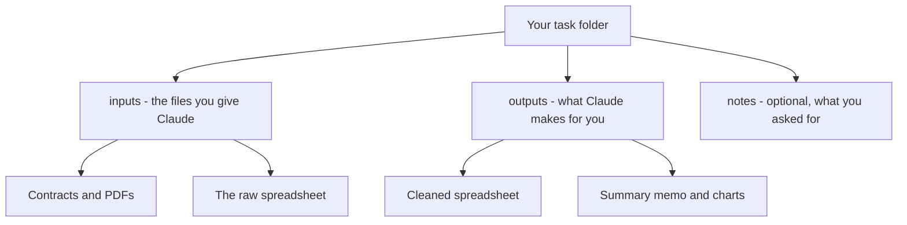

The single most common beginner worry, and almost nobody says it out loud: *"Do I just dump all my files into a folder and pray?"*

Short answer: for small jobs, basically yes — and that's fine. For bigger ones, ten minutes of light organizing makes everything smoother. This page gives you a simple system so you always know where your stuff is, where Claude's results go, and how to never lose an original.

## Start from the one rule you already know

For this beginner workflow, Claude Code starts inside the [workspace folder](/agentic-ai/claude-code/first-session/workspace) you point it at. So "managing your data" is really just *deciding what goes in that folder, and how it's arranged.* That's it — no databases, no special formats, just files in folders, the same as always.

## The dump-and-pray method (and when it's actually fine)

For a quick, one-off task, the honest truth is you *can* drop a handful of files into a folder and go:

<Steps>
  <Step title="Make a folder and drop your files in">
    A few PDFs, one spreadsheet — straight into a new folder on your Desktop.
  </Step>
  <Step title="Point Claude at it and ask">
    > What's in this folder? Then pull the totals out of each invoice into one spreadsheet.
  </Step>
</Steps>

If the job is small and you're working on **copies** (more on that below), dump-and-pray is genuinely okay. The trouble only starts when the pile gets big — or when the files you *gave* Claude and the files it *made* start blurring together.

## A tidier system for anything bigger

The fix is one idea: **keep what you put in separate from what Claude produces.** When inputs and outputs are jumbled into one heap, you can't tell originals from results, and "clean this up" starts to feel risky. Separate them and everything stays obvious.

A layout that works for almost everything:

You don't have to build this by hand. Once your files are in the folder, just ask:

> Make an `inputs` folder and an `outputs` folder. Move the original files I gave you into `inputs`, and from now on save anything you create into `outputs`. Don't change the originals.

Now there's a clean line between *source material* and *results* — and a habit Claude will keep following for the rest of the session.

## Protect your originals — the habit that matters most

If you remember one thing from this page, make it this: **work on copies of anything you can't afford to lose.**

- Drag a *copy* of that critical spreadsheet into your workspace, never your only original.
- Better yet, keep originals in the `inputs` folder and tell Claude to only ever *read* from there and *write* to `outputs`.

Claude asks permission before it changes anything, so disasters are already unlikely — but "I worked on a copy" turns the worst case from *"I lost it"* into *"I'll redo it."* More on this in [Permissions & Safety](/agentic-ai/claude-code/best-practices/permissions-and-safety).

## You don't have to pre-sort — Claude can do it for you

Here's the part that takes the pressure off: **you're allowed to dump first and organize later.** Sorting a messy pile is a job Claude is genuinely good at — it's an entire [first project](/agentic-ai/claude-code/first-projects/organize-a-folder) in this guide.

So if you've got a junk drawer of 200 files with names like `Scan_002 (final) FINAL (2).pdf`, you don't have to tidy it before you start. Just:

1. Make a **copy** of the whole messy folder.
2. Point Claude at the copy.
3. Ask it to survey everything and propose a clean structure *before* it moves anything.

You get a tidy result and your original mess stays untouched as a safety net.

## What files can Claude actually work with?

Most everyday business files, and it reads them straight from the folder — **you never upload anything one at a time.**

| If you've got… | Claude can… |
|---|---|
| Spreadsheets (Excel, CSV) | read, clean, sort, total, and chart them |
| PDFs (contracts, reports, statements) | read the text, pull out facts, summarize a whole stack at once |
| Word & text documents | read, rewrite, summarize, and compare them |
| Images & scans | often read visible text, though scans deserve extra checking |
| A mix of all of the above | work across the entire folder together |

<Note>
  This is the quiet superpower of working in a folder instead of a chat window: point Claude at fifty PDFs and it can work through **all of them at once**, rather than you pasting them in one by one. See the [glossary](/agentic-ai/claude-code/glossary) for what each file type means.
</Note>

<Warning>
  Some files are harder than they look: scanned PDFs, password-protected files, cloud placeholders, hidden Excel sheets, and giant spreadsheets all need an inspection pass. See [Files Claude May Struggle With](/agentic-ai/claude-code/first-session/file-limitations) before trusting high-stakes output.
</Warning>

## "But what about hundreds of files?"

The pile being big doesn't break anything — it just calls for a little aim:

- **Claude reads files as it needs them,** not all at once. What it can hold in mind at one time is its [context](/agentic-ai/claude-code/glossary) — its working memory for a single session.
- **Point it at the right subset.** "Just the 2024 invoices" or a single subfolder beats "all 800 files" when you only care about some of them.
- **Let it work in batches** for truly huge jobs: *"Do the first 25, show me the result, then continue with the rest."*
- **One task per session.** A giant catch-all chat gets slow and forgetful — start fresh when you switch jobs. See [Managing Cost & Context](/agentic-ai/claude-code/best-practices/cost-and-context).

## A note on sensitive files

To do its job, Claude reads the files you give it — which means their contents are sent to Anthropic's models to be processed, like any cloud tool. Follow your organization's policy on confidential material, and practice on data you wouldn't mind sharing while you're learning. Full guidance in [Permissions & Safety](/agentic-ai/claude-code/best-practices/permissions-and-safety).

## The minimum setup, in one box

<Card title="Your whole filing system" icon="folders">
  1. **One folder per task**, with a clear name. 
  2. **Originals go in `inputs`** — work on copies, never your only file. 
  3. **Results go in `outputs`** — so you never confuse what you gave it with what it made. 
  4. **Big pile? Dump first, let Claude sort it** — on a copy.

  Do that and you'll always know exactly where everything is.
</Card>

## Next

<CardGroup cols={2}>
  <Card title="The Core Loop" icon="arrows-rotate" href="/agentic-ai/claude-code/first-session/core-loop">
    Describe, review, approve, verify — the rhythm of getting work done
  </Card>
  <Card title="Files Claude May Struggle With" icon="file-circle-question" href="/agentic-ai/claude-code/first-session/file-limitations">
    Know the input edge cases before you rely on output
  </Card>
</CardGroup>
