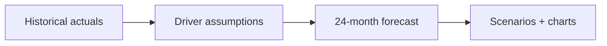

This is the deep end. The [earlier projects](/agentic-ai/claude-code/first-projects/csv-to-chart) were one-and-done tasks: clean a file, organize a folder, build a tiny tool. This one is a **standing project you maintain over time** — a financial forecasting model you'll rebuild, refresh, and interrogate month after month.

It's also the one place in this guide where we get domain-specific. A forecasting model is the perfect vehicle for the four advanced moves you've been hearing about: **organizing a real project**, **teaching Claude your method with a skill**, **querying it like an analyst**, and **wiring up a repeatable workflow**. If your background is private equity, finance, or operations, this should feel like home.

<Note>
  You still won't write or read code. You'll be the analyst and the manager; Claude is the associate who builds and maintains the model. Everything you've practiced — [planning first](/agentic-ai/claude-code/best-practices/plan-mode-and-small-steps), [verifying numbers](/agentic-ai/claude-code/best-practices/reviewing-and-verifying), [working on copies](/agentic-ai/claude-code/best-practices/permissions-and-safety) — matters more here, not less.
</Note>

## What you'll build

A simple **driver-based subscription forecast**: start from historical actuals, project customers, revenue, and cash forward 24 months, and flip between **base / upside / downside** scenarios. The model lives in a real spreadsheet with live formulas you can open and audit in Excel.



By the end you'll have a model you trust, a **skill** that rebuilds it your way every time, and a one-word **workflow** to refresh it when new numbers land.

## The four steps

<CardGroup cols={2}>
  <Card title="1. Build the model" icon="calculator" href="/agentic-ai/claude-code/forecasting-model/build-the-model">
    Turn historicals into a driver-based forecast with live formulas
  </Card>
  <Card title="2. Teach it your method" icon="wand-magic-sparkles" href="/agentic-ai/claude-code/forecasting-model/write-a-skill">
    Capture your conventions in a reusable skill
  </Card>
  <Card title="3. Ask it questions" icon="magnifying-glass-chart" href="/agentic-ai/claude-code/forecasting-model/ask-questions">
    Run scenarios, sensitivities, and goal-seeks in plain English
  </Card>
  <Card title="4. Make it repeatable" icon="diagram-project" href="/agentic-ai/claude-code/forecasting-model/workflows">
    A slash command and multi-pass workflow for the monthly refresh
  </Card>
</CardGroup>

## First, organize the project

One-off tasks live happily in a single folder. A project that outlives a single conversation needs **structure** — so that next month, a fresh Claude session (and future you) can find the inputs, the model, and the outputs without guessing.

Make a dedicated folder and give it a few sane subfolders. You don't have to do this by hand — ask Claude:

> Create a project folder called `forecast` with these subfolders: `data` for inputs, `model` for the spreadsheet, and `outputs` for charts and exports. Add a short `README.md` explaining what each folder is for.

You'll end up with something like this:

```text
forecast/
├── data/            ← inputs: historical actuals, assumption files
│   └── monthly-actuals.csv
├── model/           ← the model itself (the spreadsheet Claude builds)
│   └── forecast.xlsx
├── outputs/         ← charts, board-ready summaries, exported PDFs
├── README.md        ← what lives where
└── CLAUDE.md        ← standing instructions Claude reads every session (added later)
```

<Note>
  **Why this matters.** When you open the `forecast` folder in a new session, Claude sees this layout and immediately understands the project. "Refresh the model with the latest actuals" becomes unambiguous: new numbers go in `data`, the model in `model` gets updated, fresh charts land in `outputs`. Structure is what turns a chat into a *system*.
</Note>

The two files you'll add as you go — a **skill** (step 2) and a **`CLAUDE.md`** (step 4) — are what make this folder smart. We'll get there. For now, just the skeleton.

## Get the sample data

To follow along with the exact same numbers, grab the starter dataset and drop it in `forecast/data/`:

<Note>
  Download [monthly-actuals.csv](/agentic-ai/claude-code/examples/monthly-actuals.csv) — 18 months of fake actuals for a small subscription business: customer counts, new and churned customers, and monthly recurring revenue (MRR). A peek:

  ```csv monthly-actuals.csv
  month,customers,new_customers,churned_customers,mrr
  2024-01,80,9,4,40000
  2024-02,86,10,4,43500
  2024-03,89,8,5,45200
  ```
</Note>

<Tip>
  No data and don't want to download? Ask Claude: *"Create a CSV of 18 months of monthly actuals for a small SaaS business — customers, new customers, churned customers, and MRR — with realistic growth and churn. Save it to `data/monthly-actuals.csv`."*
</Tip>

## A reality check before you start

<Warning>
  A model that looks polished can still be subtly wrong — and a wrong forecast that *looks* authoritative is worse than no forecast. The single most important habit in this entire project is **auditing the formulas**, not just admiring the chart. We'll verify at every step. Treat Claude like a brilliant associate whose work you always check before it reaches your CFO.
</Warning>

Ready? Build the first version.

<CardGroup cols={2}>
  <Card title="Build the Model" icon="calculator" href="/agentic-ai/claude-code/forecasting-model/build-the-model">
    Start here
  </Card>
  <Card title="Back to the Overview" icon="house" href="/agentic-ai/claude-code">
    The map of this section
  </Card>
</CardGroup>
