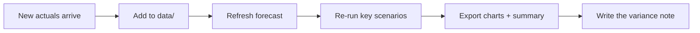
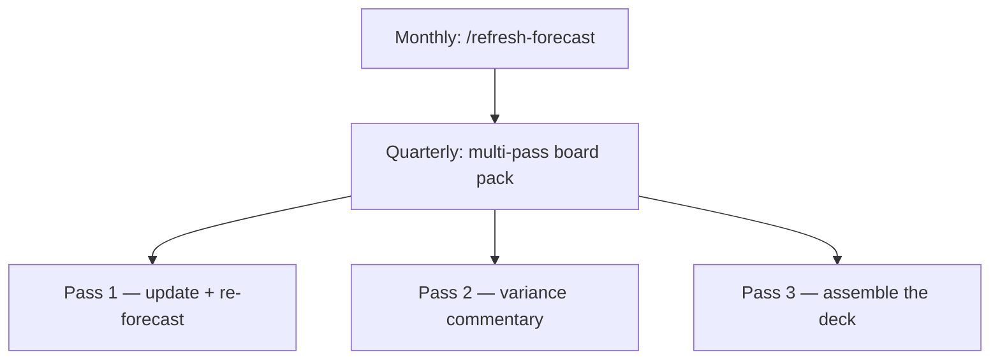

You can build the model, you've taught Claude your method, and you can interrogate it. The last move is turning the **recurring routine** — the thing you'll do every month when new actuals land — into something you trigger in one line instead of re-typing from scratch.

This is where the three advanced building blocks come together: a **`CLAUDE.md`** for standing context, a **slash command** for the routine, and **multi-pass workflows** for the big jobs.

## The monthly routine, by hand

Every month it's the same dance:



Done manually, that's six prompts and a lot of repeated context. Let's collapse it.

## 1. A CLAUDE.md so context is never re-explained

First, give the project a memory. A [`CLAUDE.md`](/agentic-ai/claude-code/going-further) in the `forecast` folder is read automatically every session — the perfect home for the standing facts about *this* project:

> Create a `CLAUDE.md` for this folder that says: this is a monthly subscription forecast; actuals live in `data/monthly-actuals.csv`; the model is `model/forecast.xlsx`; always apply the `forecast-model` skill; the fiscal year ends in December; always work on a dated copy, never overwrite the live model.

Now every session starts already knowing the project — no preamble required.

<Note>
  **Skill vs. CLAUDE.md.** The [skill](/agentic-ai/claude-code/forecasting-model/write-a-skill) is portable know-how about *how to build forecasts in general*. The `CLAUDE.md` is the standing context for *this specific folder* — where the files are, what the cadence is. Together they mean a fresh session needs almost no setup.
</Note>

## 2. A slash command for the refresh

Now save the routine itself. A **slash command** is a saved prompt you fire with `/its-name`. Have Claude create it — describe the steps once:

> Create a slash command called `refresh-forecast` that does my monthly update: read the newest rows in `data/monthly-actuals.csv`, save a dated backup of the current model, update `model/forecast.xlsx` with the new actuals and re-forecast forward 24 months, re-export the scenario chart and summary to `outputs/`, and finish with a short note on how the new actuals compared to last month's forecast.

Claude saves a command file (conventionally `.claude/commands/refresh-forecast.md`) that looks roughly like this:

```markdown refresh-forecast.md
---
description: Monthly forecast refresh — ingest new actuals, re-forecast, export, report variance
---

Apply the `forecast-model` skill, then:

1. Read `data/monthly-actuals.csv` and identify any months not yet in the model.
2. Save a dated backup of `model/forecast.xlsx` before changing it.
3. Add the new actuals and re-forecast 24 months forward from the latest one.
4. Re-export the scenario chart and one-page summary to `outputs/`.
5. Report: how did the latest actuals compare to what last month's
   forecast expected? Call out the biggest variances.
```

From now on, your entire month-end process is two words:

> /refresh-forecast

<Tip>
  A slash command can take input. Once it works, extend it: *"make `/refresh-forecast` accept a month, so `/refresh-forecast 2025-07` refreshes through that month."* Now it's a proper little tool.
</Tip>

## 3. Multi-pass workflows for the big jobs

Some jobs are too big for one pass — a quarter-end board pack, say, where the model update, the commentary, and the deck assembly are genuinely different kinds of work. This is where you let Claude **split the work into specialist passes**, the beginner-friendly version of [subagents](/agentic-ai/claude-code/best-practices/subagents-and-plugins).

You don't configure anything — you just ask for the decomposition:

> Prepare the quarterly board update in separate passes. **Pass 1:** update the model with Q2 actuals and re-forecast. **Pass 2:** write variance commentary — where did we beat or miss plan, and why. **Pass 3:** assemble a board-ready summary in `outputs/` with the scenario chart, the key numbers, and your commentary. Show me the result of each pass before moving to the next.

The "show me each pass" part keeps you in control at every handoff — you approve the updated model before commentary gets written about it, and approve the commentary before it goes in the deck.



## Verify — automation raises the stakes

A routine you trigger blindly is a routine that can go wrong quietly. Keep the human checks:

- **Confirm the backup happened.** Before trusting any refresh, check that the dated copy of the old model actually got saved. That's your undo button.
- **Read the variance note first.** It's the fastest tell that something's off — a wild variance usually means a bad new row or a broken formula, not a real business swing.
- **Spot-check after every refresh.** The command doesn't excuse you from [verifying](/agentic-ai/claude-code/best-practices/reviewing-and-verifying). Trace one number each month; it takes thirty seconds.

<Warning>
  The convenience of `/refresh-forecast` is also its risk: it's easy to run it, glance at the chart, and forward the deck. Don't. A command automates the *keystrokes*, never the *judgment*. The thirty-second spot-check is the price of trusting the one-word workflow.
</Warning>

## You've built a system

Step back and look at what this folder became. It started as an empty directory. Now it has:

- A **driver-based model** you can audit and steer.
- A **skill** that rebuilds it your way, every time.
- A **CLAUDE.md** so any session knows the project cold.
- A **slash command** that runs your month-end in two words.
- A **multi-pass workflow** for the quarterly heavy lift.

That's the whole arc of this guide, applied to something real: not a chatbot you query, but a standing system you maintain. Point it at one of your own models next.

## Next

<CardGroup cols={2}>
  <Card title="Going Further" icon="rocket" href="/agentic-ai/claude-code/going-further">
    Memory files, skills, and integrations — the wider toolkit
  </Card>
  <Card title="Subagents &amp; Plugins" icon="puzzle-piece" href="/agentic-ai/claude-code/best-practices/subagents-and-plugins">
    The architecture behind multi-pass workflows
  </Card>
</CardGroup>
