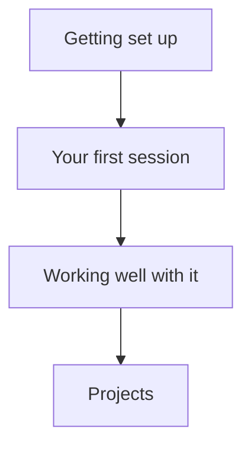

Most guides to Claude Code assume you're already a software engineer. This one doesn't.

## Navigate the guide

<CardGroup cols={2}>
  <Card title="Getting Set Up" icon="download" href="/agentic-ai/claude-code/setup/what-is-claude-code">
    What Claude Code actually is, and how to install it on Mac or Windows — desktop app first, no jargon
  </Card>
  <Card title="Your First Session" icon="circle-play" href="/agentic-ai/claude-code/first-session/workspace">
    Set up a workspace, learn the key controls, and understand what files Claude can read
  </Card>
  <Card title="Working Well With It" icon="thumbs-up" href="/agentic-ai/claude-code/best-practices/writing-prompts">
    The habits that keep work safe: plan, verify, rewind, recover, and delegate thoughtfully
  </Card>
  <Card title="Projects" icon="list-check" href="/agentic-ai/claude-code/first-projects/csv-to-chart">
    Hands-on wins — clean a spreadsheet, organize a folder, summarize PDFs, build a tool, then build a full financial forecasting model
  </Card>
</CardGroup>

The four stages build in order: get set up, run your first session, learn the habits that keep you safe, then put it all to work on real projects.

## Who this is for

This section is for **complete beginners** — people who work in business, finance, consulting, or operations and have never thought of themselves as "technical." You don't need to know what a [terminal](/agentic-ai/claude-code/glossary) is. You don't need to have written code. You just need to be curious about what happens when you give a capable AI agent the ability to actually *do things* on your computer.

By the end, you'll be able to point Claude Code at a messy spreadsheet, a folder of PDFs, or a half-formed idea and get real work back.

## Why a "coding tool" matters even if you never code

Claude Code is marketed as a coding assistant, and that scares people off. Here's the reframe: **Claude Code is an AI agent that can operate your computer** — read your files, analyze your data, write and run small programs, and hand you the result. The "code" is usually just the means to an end. You care about the clean chart, the organized folder, the summarized deal docs — not the Python that produced them.

If you can describe what you want in plain English, you can use it.

## What you'll need

- A computer running **macOS or Windows** (Claude Code's desktop app supports both).
- A **paid Claude plan** (Pro or higher) for the desktop-app path this guide uses. The free Claude.ai plan does *not* include Claude Code — this is the single most common reason beginners get stuck.
- About **20 minutes** to get set up, and a real task you actually want done.

<Note>
  No bioinformatics or science background required here — unlike the rest of this site, this section is fully general-purpose. The examples are the kinds of things anyone in business deals with: spreadsheets, documents, and folders full of files.
</Note>

Ready? Start with [What Claude Code Actually Is →](/agentic-ai/claude-code/setup/what-is-claude-code)
