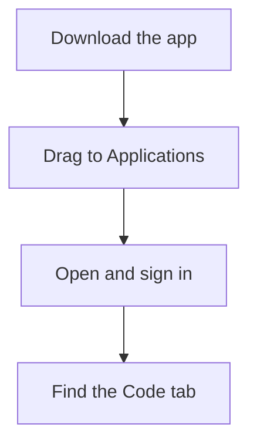

For a beginner, installing Claude Code on a Mac is genuinely a five-minute, few-clicks affair. We'll use the **desktop app**, which bundles everything — there's nothing else to install and no terminal required.

## Before you start: you need a paid plan

This is the single most common thing that trips people up, so let's get it out of the way:

<Warning>
  **The free Claude plan does not include Claude Code.** You need a paid plan — **Pro**, **Max**, **Team**, or **Enterprise**. If you sign in and the Code features won't work, this is almost always why.
</Warning>

If you don't have one yet, you can subscribe at [claude.ai](https://claude.ai) before or after installing.

## System requirements

- macOS **13 (Ventura) or newer**
- Any Mac from roughly the last several years (Intel or Apple Silicon — the app runs on both)
- An internet connection

## Install the desktop app (recommended)

At a glance, the whole thing is four steps:



<Steps>
  <Step title="Download the app">
    Go to the official download page at [claude.ai/download](https://claude.ai/download) and download the **macOS** version. It's a normal `.dmg` file, like most Mac apps.
  </Step>
  <Step title="Drag it to Applications">
    Open the downloaded file and drag the **Claude** icon into your **Applications** folder. That's the standard Mac install — nothing unusual here.
  </Step>
  <Step title="Open it and sign in">
    Launch Claude from your Applications folder (or Spotlight). Sign in with the same account that has your paid plan.
  </Step>
  <Step title="Find the Code tab">
    The app has a few tabs across the top — **Chat**, **Cowork**, and **Code**. The **Code** tab is Claude Code. That's where everything in this guide happens.
  </Step>
</Steps>

That's it. No Node.js, no terminal, no extra downloads. You're ready for [Your First Session](/agentic-ai/claude-code/first-session/workspace).

<Tip>
  **Do you need Git?** On a Mac, Git is usually already installed, and the desktop app doesn't strictly require it the way Windows does. If you ever see a message about Git, you can install it later — we cover it on [What Else to Install](/agentic-ai/claude-code/setup/what-else-to-install). Don't worry about it for now.
</Tip>

## The terminal option (you can skip this)

This whole site mostly uses Claude Code from the **[terminal](/agentic-ai/claude-code/glossary)** (the black-and-white command window), because that's how power users run it. As a beginner you do **not** need this — the desktop app is the better starting point. But if you're curious or want to graduate to it later, here are the three ways to install the command-line version on a Mac.

<Note>
  These are optional. If the desktop app is working, skip straight to the next section.
</Note>

<Tabs>
  <Tab title="Official installer (easiest)">
    Open the **Terminal** app and paste this in:

    ```bash
    curl -fsSL https://claude.ai/install.sh | bash
    ```

    This installs the `claude` command and keeps itself up to date automatically. No Node.js required.
  </Tab>
  <Tab title="Homebrew">
    If you use [Homebrew](https://brew.sh) (a popular Mac package manager):

    ```bash
    brew install --cask claude-code
    ```

    Note: Homebrew installs **don't auto-update**. You'll need to run `brew upgrade claude-code` yourself now and then.
  </Tab>
  <Tab title="npm">
    If you already have Node.js (version 18 or newer):

    ```bash
    npm install -g @anthropic-ai/claude-code
    ```

    Only pick this if you already live in the Node world — otherwise the official installer is simpler.
  </Tab>
</Tabs>

Once installed, you start it by opening Terminal and typing `claude` inside the folder you want to work in. (The [workspace page](/agentic-ai/claude-code/first-session/workspace) explains what "inside the folder" means.)

## Common hiccups on Mac

<AccordionGroup>
  <Accordion title="It says I need a subscription / Code features are greyed out">
    You're on the free plan. Claude Code requires Pro or higher. Subscribe at [claude.ai](https://claude.ai), then sign out and back in.
  </Accordion>
  <Accordion title="I installed a command-line tool earlier and Claude can't find it">
    The desktop app reads your shell's `PATH` to find tools, but it doesn't pick up every change automatically. After installing something new, **fully quit and reopen** the Claude app.
  </Accordion>
  <Accordion title="A 403 / authentication error">
    Sign out and back in from the app menu. If that doesn't fix it, double-check that your paid subscription is active.
  </Accordion>
</AccordionGroup>

## Next

<CardGroup cols={2}>
  <Card title="What Else to Install" icon="screwdriver-wrench" href="/agentic-ai/claude-code/setup/what-else-to-install">
    The handful of companion tools worth having
  </Card>
  <Card title="Your First Session" icon="circle-play" href="/agentic-ai/claude-code/first-session/workspace">
    Set up a workspace and run your first task
  </Card>
</CardGroup>
