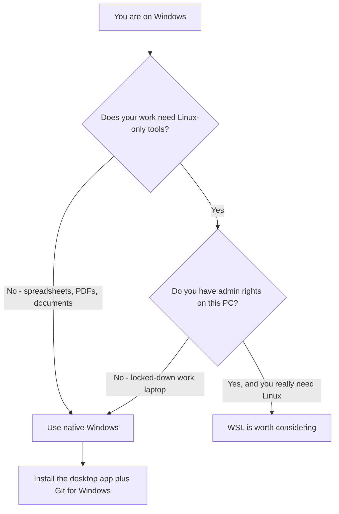

Windows takes a little more care than Mac — there's **one extra install** (Git) and **one decision** (WSL or not) that Mac users don't face. We'll keep both simple. For a business user, the short version is: **install the desktop app, install Git for Windows, and skip WSL.** Here's the why and the how.

## Before you start: you need a paid plan

<Warning>
  **The free Claude plan does not include Claude Code.** You need **Pro**, **Max**, **Team**, or **Enterprise**. If the Code features won't work after you sign in, this is almost always the reason.
</Warning>

## System requirements

- Windows **10 (version 1809) or newer**, or Windows 11
- An internet connection
- No administrator rights needed for the recommended path (this matters on locked-down work laptops — see below)

## Step 1: Install the desktop app

<Steps>
  <Step title="Download the app">
    Go to [claude.ai/download](https://claude.ai/download) and download the **Windows** installer (there are x64 and ARM64 versions — pick the one matching your PC; x64 is the common one).
  </Step>
  <Step title="Run the installer">
    Open the downloaded file and follow the prompts. The standard install does **not** require administrator rights.
  </Step>
  <Step title="Sign in">
    Launch Claude and sign in with the account that has your paid plan.
  </Step>
  <Step title="Find the Code tab">
    The app has **Chat**, **Cowork**, and **Code** tabs. **Code** is Claude Code — that's where this guide lives.
  </Step>
</Steps>

## Step 2: Install Git for Windows (required)

This is the part Mac users get to skip. On Windows, **the Code tab will not start a local session unless Git is installed.** It's a hard requirement, not a suggestion.

<Steps>
  <Step title="Download Git for Windows">
    Get it from the official site: [git-scm.com/downloads/win](https://git-scm.com/downloads/win).
  </Step>
  <Step title="Install with the defaults">
    Run the installer and accept the default options the whole way through. You don't need to understand any of the screens — the defaults are fine.
  </Step>
  <Step title="Restart the Claude app">
    Fully close and reopen Claude so it notices Git is now installed.
  </Step>
</Steps>

<Note>
  Beyond just unlocking the Code tab, Git makes Claude **more capable** on Windows — with Git installed, it uses a more powerful built-in toolset (Git Bash) instead of a more limited one. So this step is worth doing even though it feels like a detour.
</Note>

## The WSL question (and why you can probably ignore it)

If you read anything online about Claude Code on Windows, you'll hit the term **WSL** (Windows Subsystem for Linux). People treat it like a required step. For your situation, it usually isn't. Here's the plain-English version.

**WSL is a way to run a Linux computer *inside* your Windows computer.** Some technical projects need Linux-only tools, and WSL gives you those. But it adds complexity, and — crucially — **it requires administrator rights to turn on**, which many corporate laptops block.

Here's the comparison:

| | Native Windows (recommended) | WSL |
|---|---|---|
| **Setup effort** | Just install Git | Enable WSL, set up a Linux system, move files into it |
| **Admin rights?** | Not required | **Required** to enable it |
| **Good for** | Spreadsheets, PDFs, documents, scripts — i.e. business work | Linux-specific developer toolchains |
| **Beginner-friendly?** | Yes | Not really |



<Tip>
  **For a business/finance user working with spreadsheets, documents, and folders: use native Windows.** You do not need WSL. You'd only want it if a specific technical project told you it required Linux tools — and if you're at that point, you're past "beginner."
</Tip>

### How the desktop app handles this

Good news: **the desktop app runs natively on Windows** and doesn't use WSL at all. There's no confusing "choose your environment" switch to worry about — you install the app, install Git, and you're done. (If an advanced user genuinely wants WSL, they run the *command-line* version of Claude Code from inside WSL instead — but that's not something the desktop app does, and not something you need.)

## The terminal option (you can skip this)

As a beginner you don't need the command-line version — the desktop app is the better entry point. But if you ever want it, here are the install methods.

<Note>
  Optional. If the desktop app works, skip ahead.
</Note>

<Tabs>
  <Tab title="PowerShell (official installer)">
    Open **PowerShell** and run:

    ```powershell
    irm https://claude.ai/install.ps1 | iex
    ```

    Auto-updates itself. No admin rights required.
  </Tab>
  <Tab title="Command Prompt (CMD)">
    If you're in the old **Command Prompt** instead of PowerShell:

    ```bat
    curl -fsSL https://claude.ai/install.cmd -o install.cmd && install.cmd && del install.cmd
    ```
  </Tab>
  <Tab title="winget">
    If you use Windows' built-in package manager:

    ```powershell
    winget install Anthropic.ClaudeCode
    ```

    Note: winget installs **don't auto-update** — run `winget upgrade Anthropic.ClaudeCode` to update.
  </Tab>
</Tabs>

<Warning>
  PowerShell and Command Prompt use **different** install commands (see the tabs above). Pasting the PowerShell command into CMD, or vice versa, will fail. If you're not sure which one you're in, use the desktop app instead.
</Warning>

## Common hiccups on Windows

<AccordionGroup>
  <Accordion title="The Code tab won't start / 'Git is required'">
    You haven't installed Git for Windows yet, or you installed it but didn't restart the app. Install it from [git-scm.com/downloads/win](https://git-scm.com/downloads/win), then fully quit and reopen Claude.
  </Accordion>
  <Accordion title="I can't enable WSL — it asks for admin rights">
    That's expected on a managed/corporate machine. You don't need WSL — use the native Windows path described above. It works without admin rights.
  </Accordion>
  <Accordion title="Claude can't find a tool I installed (python, etc.)">
    The desktop app inherits your system environment but **does not read your PowerShell profile**. First confirm the tool works in a normal terminal, then restart the Claude app. For variables specifically, the app has an environment editor (in the prompt box, open the environment dropdown → gear icon) where you can set them for your sessions.
  </Accordion>
  <Accordion title="A 403 / authentication error">
    Sign out and back in from the app menu. If it persists, check that your paid subscription is active.
  </Accordion>
  <Accordion title="'Concurrent installation' error during install">
    Run the installer again as Administrator (right-click → Run as administrator) to clear it.
  </Accordion>
</AccordionGroup>

## Next

<CardGroup cols={2}>
  <Card title="What Else to Install" icon="screwdriver-wrench" href="/agentic-ai/claude-code/setup/what-else-to-install">
    The handful of companion tools worth having
  </Card>
  <Card title="Your First Session" icon="circle-play" href="/agentic-ai/claude-code/first-session/workspace">
    Set up a workspace and run your first task
  </Card>
</CardGroup>
