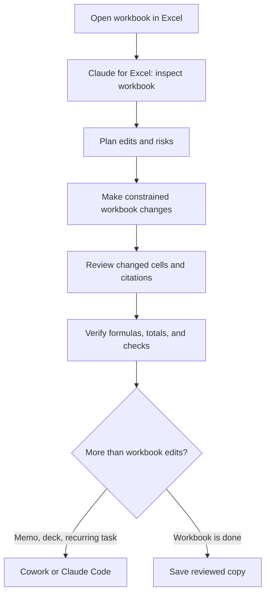

Spreadsheets are where a lot of real work lives: forecasts, budgets, operating dashboards, customer exports, trial balances, inventory plans, and board reporting. Claude can help with all of that, but the best surface depends on what you are trying to change.

The simple rule:

<Card title="If the workbook itself is the work, start with Claude for Excel." icon="file-excel">
  Use the Excel add-in when you want Claude to inspect cells, trace formulas, update assumptions, preserve workbook structure, cite source cells, debug errors, or make changes directly inside Excel. Use Chat, Cowork, and Claude Code around that core workflow when the job moves beyond one open workbook.
</Card>

## The four surfaces

| Surface | Best for | Watch out for |
|---|---|---|
| **Claude for Excel** | Live workbook work: formulas, assumptions, scenarios, formatting, pivots, charts, model review, and cell-level citations | You still need to review changes. It is not a substitute for audit judgment, and it has limits around advanced Excel features like data tables, macros, and VBA. |
| **Claude Chat** | Thinking, explaining, drafting, quick analysis, and one-off files when the spreadsheet is not a long-lived model | Uploaded files are separated from your actual workbook workflow. It is easier to lose track of which version is current. |
| **Claude Cowork** | Longer knowledge-work tasks that touch files, folders, recurring work, or multiple outputs like a workbook plus a memo or deck | More autonomy means more scope. Be careful with sensitive files, cross-app data sharing, and "act without asking" style workflows. |
| **Claude Code** | Project-style spreadsheet systems: folders, repeatable refreshes, scripts, validation checks, generated workbooks, skills, and versioned workflows | It is usually not the fastest tool for one cell, one formula, or one chart inside an already-open workbook. |

This is the spreadsheet version of [Choosing the Right Tool](/agentic-ai/when-to-use-what): start simple, pick the smallest surface that can safely do the job, and add more machinery only when the workflow needs it.

## Start in Claude for Excel

[Claude for Excel](https://support.claude.com/en/articles/12650343-use-claude-for-excel) is an Excel add-in. That matters. Claude is not just reading a pasted table in a chat window; it can work with the open workbook's cells, formulas, tabs, formatting, and relationships.

Use it for:

- **Understanding a workbook.** Ask what drives a forecast, how a formula flows through the model, which tabs feed an output, or why a balance does not reconcile.
- **Updating assumptions.** Change growth, churn, pricing, costs, hiring, or discount-rate assumptions while preserving formula dependencies.
- **Debugging formulas.** Trace `#REF!`, `#VALUE!`, circular references, broken lookups, and formulas that return a plausible but wrong number.
- **Building or filling templates.** Populate a standard model, build a dashboard, create a scenario tab, or convert a raw export into a cleaner workbook.
- **Native Excel edits.** Sort, filter, format, add conditional formatting, set validation, edit charts, adjust pivots, and prepare a workbook for printing.
- **Cell-level citations.** Ask Claude to cite the exact cells behind a claim so you can jump straight to the source.

<Tip>
  A good first prompt is not "fix this." Start with inspection:

  > Before changing anything, inspect this workbook. List the tabs, identify the input areas, key formulas, outputs, hidden sheets, errors, and anything risky or unclear. Cite the important cells you reference.
</Tip>

## When to use each one

| You want to... | Use | Why |
|---|---|---|
| Explain a confusing formula | **Claude for Excel** | It can cite the formula cell and trace the precedents. |
| Change one assumption and see the model impact | **Claude for Excel** | The workbook stays live, and dependencies are preserved. |
| Find hard-coded values that should be formulas | **Claude for Excel** | It can inspect formulas and constants inside the workbook. |
| Brainstorm the right model structure before building | **Claude Chat** | You are thinking, not editing yet. Keep the workbook untouched. |
| Clean a simple CSV and make a quick chart | **Claude Chat** or **Claude Code** | Chat is fine for small one-offs. Claude Code is better if you want saved files, scripts, and repeatable outputs. |
| Refresh a monthly reporting package | **Claude Code** or **Cowork** | The task probably includes inputs, outputs, backups, validation, and commentary beyond one workbook. |
| Turn an Excel model into a memo or deck | **Cowork** or Microsoft 365 cross-app work | The job spans Excel, Word, PowerPoint, and maybe email. |
| Build a repeatable workflow you run every month | **Claude Code** | Put the workbook in a project folder, add rules, write checks, and save the routine. |
| Have several related spreadsheet tasks run in parallel | **Cowork** | It can coordinate longer tasks and sub-workstreams. |

## Content management

The easiest way to make Claude better at spreadsheets is to make the workbook easier to understand. Do the boring organization up front.

### Keep the workbook legible

Use tabs with jobs:

```text
README        - what this workbook is and how to use it
Inputs        - assumptions and user-editable values
Raw Data      - untouched exports or source data
Clean Data    - normalized data used by the model
Calculations  - formulas and intermediate logic
Outputs       - charts, summary tables, dashboard, board view
Checks        - reconciliations, tie-outs, error flags
Claude Log    - optional record of Claude's changes
```

You do not need every tab for every workbook. The point is separation: inputs are not outputs, raw data is not cleaned data, and checks are not hidden in the corner of a model tab.

### Tell Claude what is sacred

Use direct rules:

```text
Do not edit Raw Data.
Do not overwrite formulas with hard-coded values.
Use blue font for inputs and black font for formulas.
Put new outputs on the Outputs tab unless I say otherwise.
If a number does not reconcile, stop and tell me before changing more cells.
```

That is content management. You are not just asking for an answer; you are defining how the workbook should be maintained.

### Version before big edits

For anything important, make a copy before the session or ask Claude to do it:

```text
Before changing the workbook, create a dated backup copy. Then make edits only in the working copy.
```

This is the same habit from [Managing Your Data & Files](/agentic-ai/claude-code/first-session/managing-data-and-files): originals stay safe, outputs are easy to find, and you always know what changed.

## Instructions and Skills

Claude for Excel has two important memory layers:

- **Instructions** are the persistent preferences for Excel work: formatting conventions, output style, modeling rules, or how you like commentary written.
- **Skills** are reusable playbooks Claude can apply when a task needs specialized knowledge.

Put stable preferences in the Excel add-in's Instructions field:

```text
Use finance-style formatting: blue font for hard-coded inputs, black font for formulas, green font for links to other sheets, yellow fill for key assumptions. Never hard-code forecast periods. Add a Checks tab for tie-outs and explain any assumption you invent.
```

Use a Skill when you want a repeatable method, especially if multiple people or multiple workbooks should follow the same playbook. For example:

```text
Apply our monthly reporting skill: keep raw exports untouched, normalize data on Clean Data, refresh the dashboard, update variance commentary, and run the checks tab before summarizing results.
```

This matches the pattern from the forecasting project: use a skill for the method, and use the workbook or project folder for the specific files. See [Build a Forecasting Model](/agentic-ai/claude-code/forecasting-model) and [Skills](/agentic-ai/skills) for the deeper version.

## Prompt patterns that work

<AccordionGroup>
  <Accordion title="Inspect before changing">
    > Before editing anything, inspect the workbook. Tell me the purpose of each tab, where the inputs are, where formulas begin, which tabs feed the summary, and any hidden sheets, broken formulas, or risky assumptions you find.
  </Accordion>

  <Accordion title="Make a constrained edit">
    > Change only the growth assumption in `Inputs!B12` from 8% to 6%. Do not change formulas. Then show me which output cells changed the most and cite them.
  </Accordion>

  <Accordion title="Debug a formula">
    > Cell `Summary!F24` looks wrong. Trace it back to its source cells, explain the formula in plain English, identify the likely issue, and propose a fix before applying it.
  </Accordion>

  <Accordion title="Build safely">
    > Add a downside scenario. Put all new assumptions on the Inputs tab, keep forecast cells formula-driven, add checks that tie ending cash and revenue totals, and highlight every cell you change.
  </Accordion>

  <Accordion title="Review like an analyst">
    > Review this model as if it will go to a CFO. Find hard-coded forecast cells, broken links, inconsistent formulas across periods, missing checks, and assumptions that are not documented. Do not edit yet.
  </Accordion>
</AccordionGroup>

## Verification checklist

The Excel add-in makes spreadsheet work faster, not automatically correct. Keep a short audit loop.

<Steps>
  <Step title="Review changed cells">
    Look at the cells Claude changed before saving or sharing the workbook. If it made broad edits, ask for a list grouped by tab.
  </Step>
  <Step title="Trace one important number">
    Pick one output that matters and ask Claude to cite every source cell behind it. Then inspect the cells yourself.
  </Step>
  <Step title="Test a driver">
    Change a key input, like growth or churn, and confirm the expected outputs move. If nothing changes, you may have hard-codes or broken formulas.
  </Step>
  <Step title="Reconcile totals">
    Compare before and after totals. Row counts, revenue totals, cash, headcount, and ending balances should move only for explainable reasons.
  </Step>
  <Step title="Check workbook edge cases">
    Ask about hidden sheets, protected sheets, external links, pivot sources, named ranges, macros, and formulas that use volatile functions.
  </Step>
</Steps>

For high-stakes work, combine this with the general [Reviewing & Verifying](/agentic-ai/claude-code/best-practices/reviewing-and-verifying) habits: spot-check known answers, ask Claude to show its work, and match your scrutiny to the consequences.

## Safety and limits

There are three spreadsheet-specific risks worth taking seriously.

<Warning>
  **Do not use Claude for Excel on untrusted spreadsheets without caution.** Vendor templates, downloaded workbooks, collaborative files, and imported data can contain hidden instructions in cells, formulas, comments, or other content. Anthropic's own documentation calls out prompt-injection risk for spreadsheets.
</Warning>

<Warning>
  **Do not treat Claude as the accountable reviewer.** It can help find errors, but you are still responsible for final client deliverables, audit-critical calculations, regulated data, and financial judgment.
</Warning>

<Warning>
  **Know the feature limits.** Anthropic's current docs list `.xlsx` and `.xlsm` support, but also call out limits around advanced Excel capabilities including data tables, macros, and VBA. If your workbook depends on those, ask Claude what it can and cannot safely inspect before relying on the result.
</Warning>

Cowork adds one more wrinkle: cross-app context. If you let Claude work across Excel, PowerPoint, Word, and Outlook, it may carry spreadsheet context into other outputs. That is powerful for board packs and memos, but it also means sensitive spreadsheet data can travel farther than you intended. Anthropic's Cowork safety docs explicitly warn users to watch for cross-app data sharing.

## A good spreadsheet workflow

For most real spreadsheet work, the workflow looks like this:



The center of gravity stays in Excel. Chat helps you think. Cowork helps when the task becomes a broader work package. Claude Code helps when the spreadsheet becomes a repeatable system.

## Next

<CardGroup cols={2}>
  <Card title="Choosing the Right Tool" icon="screwdriver-wrench" href="/agentic-ai/when-to-use-what">
    The broader decision guide for skills, commands, subagents, scripts, and direct prompting
  </Card>
  <Card title="Managing Your Data & Files" icon="folders" href="/agentic-ai/claude-code/first-session/managing-data-and-files">
    Keep inputs, originals, and outputs separated before Claude touches anything
  </Card>
  <Card title="Reviewing & Verifying" icon="magnifying-glass" href="/agentic-ai/claude-code/best-practices/reviewing-and-verifying">
    Build the habit that keeps confident answers from becoming quiet mistakes
  </Card>
  <Card title="Build a Forecasting Model" icon="chart-line" href="/agentic-ai/claude-code/forecasting-model">
    A deeper spreadsheet project with formulas, scenarios, skills, and refresh workflows
  </Card>
</CardGroup>

## Official references

- [Use Claude for Excel](https://support.claude.com/en/articles/12650343-use-claude-for-excel)
- [Get started with Claude Cowork](https://support.claude.com/en/articles/13345190-get-started-with-claude-cowork)
- [Use Claude Cowork safely](https://support.claude.com/en/articles/13364135-use-claude-cowork-safely)
- [Work across Microsoft 365 apps](https://support.claude.com/en/articles/13892150-work-across-microsoft-365-apps)
