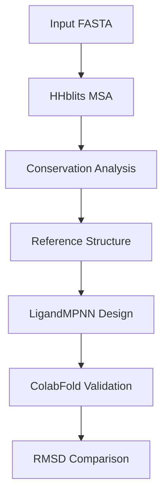

# Design Pipeline

This comprehensive pipeline automates the complete protein design workflow, from sequence analysis through structure validation. It chains together multiple tools with SLURM job dependencies.

<Note>
  **Siegel Lab:** This pipeline uses Siegel Lab paths and accounts on HIVE. See the [Siegel Lab HPC Guide](/hpc/uc-davis/using-hive/siegel-lab) for account setup.
</Note>

## Overview

The pipeline performs these steps automatically:



## Usage

```bash
python run_pipeline.py input.fasta [options]
```

### Basic Example

```bash
python run_pipeline.py my_protein.fasta
```

### With Custom Parameters

```bash
python run_pipeline.py my_protein.fasta \
    --chain A \
    --conservation-threshold 0.7 \
    --fixed-residues "A10,A25,A100" \
    --batch-size 32 \
    --num-batches 8 \
    --temperatures 0.1 0.2 0.3
```

### Dry Run (Preview Jobs)

```bash
python run_pipeline.py my_protein.fasta --dry-run
```

## Arguments

| Argument | Default | Description |
|----------|---------|-------------|
| `input.fasta` | Required | Input protein sequence |
| `--chain` | A | Chain to design |
| `--dry-run` | False | Generate scripts without submitting |
| `--conservation-threshold` | 0.8 | Fraction of sequences with residue to consider conserved |
| `--fixed-residues` | None | Additional residues to fix (format: "A10,A25") |
| `--batch-size` | 16 | LigandMPNN batch size |
| `--num-batches` | 4 | Number of LigandMPNN batches |
| `--temperatures` | 0.1 0.2 0.3 | Sampling temperatures |

## Pipeline Stages

### 1. HHblits MSA Generation

Generates a multiple sequence alignment using iterative HHblits searches with decreasing E-value thresholds:

- Round 1: E-value 1e-50 (closest homologs)
- Round 2: E-value 1e-30
- Round 3: E-value 1e-10
- Round 4: E-value 1e-4 (distant homologs)

**Resources:** 4 CPUs, 32 GB, 2 hours (CPU partition)

### 2. MSA Filtering (HHfilter)

Filters the MSA to remove redundant sequences:
- Identity threshold: 90%
- Coverage threshold: 50%
- Query identity: 30%

**Resources:** 2 CPUs, 8 GB, 30 minutes (CPU partition)

### 3. Conservation Analysis

Analyzes the filtered MSA to identify conserved residues. Residues conserved above the threshold are fixed during design.

**Resources:** 1 CPU, 8 GB, 10 minutes (CPU partition)

### 4. Reference Structure Prediction

Predicts a reference structure using ColabFold (monomer mode).

**Resources:** 1x A100 GPU, 16 CPUs, 32 GB, 17 hours

### 5. LigandMPNN Design

Runs LigandMPNN at multiple temperatures to generate diverse sequences:
- Temperature 0.1: Conservative designs (closer to wild-type)
- Temperature 0.2: Moderate diversity
- Temperature 0.3: Higher diversity

**Resources:** 1x A100 GPU, 32 GB, 10 hours

### 6. Design Validation

Predicts structures for all designs using ColabFold (array job).

**Resources:** 1x A100 GPU per design, 16 CPUs, 32 GB, 17 hours

### 7. RMSD Comparison

Calculates RMSD between each design prediction and the reference structure using PyMOL.

**Resources:** 4 CPUs, 16 GB, 2 hours (CPU partition)

## Output Structure

```
jobs/JOBNAME/
├── logs/                    # SLURM output logs
├── input.fa                 # Copy of input FASTA
├── hhblits/
│   ├── *.a3m                # Raw MSA
│   ├── *_filtered.a3m       # Filtered MSA
│   └── conservation.txt     # Conservation analysis
├── reference/
│   └── *.pdb                # Reference structure
├── ligandmpnn/
│   ├── T0.1/                # Temperature 0.1 designs
│   ├── T0.2/                # Temperature 0.2 designs
│   └── T0.3/                # Temperature 0.3 designs
├── colabfold/
│   └── *.pdb                # Predicted structures
├── pymol_analysis/
│   └── rmsd_results.csv     # RMSD comparison
└── cache/                   # Temporary files
```

## Resource Summary

| Stage | Partition | GPU | CPUs | Memory | Time |
|-------|-----------|-----|------|--------|------|
| HHblits | low | - | 4 | 32G | 2h |
| HHfilter | low | - | 2 | 8G | 30m |
| Conservation | low | - | 1 | 8G | 10m |
| Reference | gpu-a100 | 1 | 16 | 32G | 17h |
| LigandMPNN | gpu-a100 | 1 | - | 32G | 10h |
| ColabFold | gpu-a100 | 1 | 16 | 32G | 17h |
| PyMOL | low | - | 4 | 16G | 2h |

## Conservation Threshold

The `--conservation-threshold` parameter controls how many residues are fixed:

| Threshold | Effect |
|-----------|--------|
| 0.9 | Only highly conserved residues fixed (more design freedom) |
| 0.8 | Default, balances conservation and exploration |
| 0.7 | More residues fixed (more conservative designs) |
| 0.5-0.6 | Broad design space exploration |

<Tip>
  **Start conservative:** Begin with the default threshold (0.8) and adjust based on results. Lower thresholds give more design freedom but higher risk of non-functional designs.
</Tip>

## Interpreting Results

After the pipeline completes, check `pymol_analysis/rmsd_results.csv`:

| RMSD Range | Interpretation |
|------------|----------------|
| < 1.0 Å | Very similar to reference, likely folds correctly |
| 1.0-2.0 Å | Minor deviations, probably acceptable |
| 2.0-4.0 Å | Notable differences, review structure |
| > 4.0 Å | Major deviations, likely problematic |

<Warning>
  **Validation is critical:** Low RMSD doesn't guarantee function. Designs should still be experimentally tested, especially for activity-critical applications.
</Warning>
