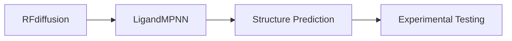

<Note>
  **Siegel Lab:** These scripts use Siegel Lab paths and accounts on HIVE. See the [Siegel Lab HPC Guide](/hpc/uc-davis/using-hive/siegel-lab) for account setup.
</Note>

## Usage

```bash
sbatch rf_diffusion_aa.sh output_prefix input.pdb
```

### Arguments

| Argument | Description |
|----------|-------------|
| `$1` | Output prefix for generated structures |
| `$2` | Input PDB file (optional, for scaffolding) |

### SLURM Configuration

```bash
#!/bin/bash
#SBATCH --partition=gpu-a100
#SBATCH --gres=gpu:1
#SBATCH --cpus-per-task=4
#SBATCH --mem=16G
#SBATCH --time=24:00:00
```

### Resource Requirements

| Resource | Value |
|----------|-------|
| GPU | 1x A100 |
| CPUs | 4 |
| Memory | 16 GB |
| Time | 24 hours |
| Partition | `gpu-a100` |

## Contig Maps

The key to controlling RFdiffusion is the **contig map**, which specifies what to generate:

### Basic Syntax

```
contigmap.contigs=[A1-50/0 B1-30]
```

| Symbol | Meaning |
|--------|---------|
| `A1-50` | Keep residues 1-50 from chain A |
| `/0` | No gap (chains are connected) |
| `B1-30` | Keep residues 1-30 from chain B |
| `50-100` | Generate 50-100 new residues |

### Examples

**Generate a 100-residue protein de novo:**
```bash
contigmap.contigs=[100]
```

**Scaffold a motif (residues 10-30 from input):**
```bash
contigmap.contigs=[A10-30/20-40/A10-30]
```

**Design a binder to a target:**
```bash
contigmap.contigs=[A1-100/0 70-100]
```

## Customizing the Script

Edit the `contigmap.contigs` parameter in the script:

```bash
# In rf_diffusion_aa.sh
apptainer exec ... run_inference.py \
    inference.output_prefix=$1 \
    inference.input_pdb=$2 \
    contigmap.contigs=[YOUR_CONTIG_MAP_HERE]
```

## Example Workflows

### De Novo Design

Generate completely new protein structures:

```bash
# Generate 50 designs of 80-120 residue proteins
for i in {1..50}; do
    sbatch rf_diffusion_aa.sh designs/denovo_${i} none
done
```

### Motif Scaffolding

Scaffold a functional motif in a new protein context:

<Steps>
  <Step title="Identify the motif">
    Extract the functional residues from your input PDB (e.g., active site, binding interface).
  </Step>
  <Step title="Design the contig map">
    Specify which residues to keep fixed and where to generate new structure.
  </Step>
  <Step title="Run RFdiffusion">
    ```bash
    sbatch rf_diffusion_aa.sh scaffold_design motif.pdb
    ```
  </Step>
  <Step title="Design sequences">
    Use [LigandMPNN](/protein-engineering/design/ligandmpnn) to design sequences for generated backbones.
  </Step>
</Steps>

## Output

RFdiffusion outputs PDB files containing designed backbone structures. These structures need sequence design (using LigandMPNN or ProteinMPNN) before they can be experimentally tested.

## Typical Pipeline



1. **RFdiffusion**: Generate backbone structures
2. **LigandMPNN**: Design sequences for backbones
3. **Structure Prediction**: Validate designs fold correctly
4. **Experimental Testing**: Express and characterize

<Tip>
  **Multiple seeds:** Run multiple times with different random seeds to generate diverse designs.
</Tip>

<Warning>
  **Backbone only:** RFdiffusion outputs backbone coordinates only. You must design sequences separately using LigandMPNN or ProteinMPNN.
</Warning>
