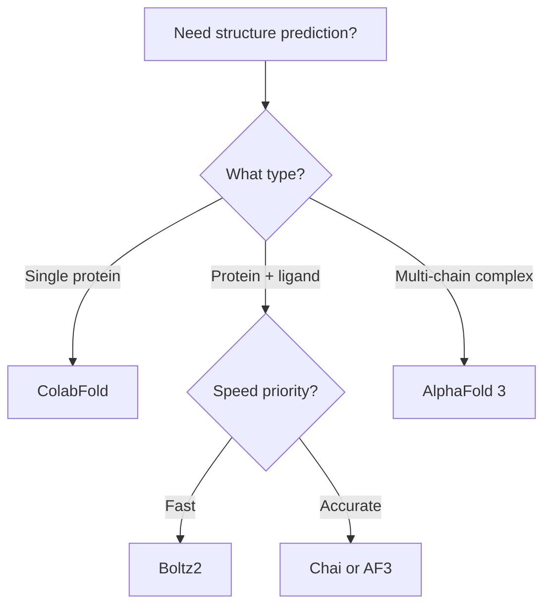

# Getting Started

This guide introduces the computational protein engineering tools available on HIVE and helps you choose the right tool for your task.

## Prerequisites

Before using these tools, ensure you have:

<Steps>
  <Step title="HIVE account">
    Access to UC Davis HIVE cluster. See [Getting Started with HIVE](/hpc/uc-davis/getting-started-hive).
  </Step>
  <Step title="Siegel Lab access (if applicable)">
    For Siegel Lab-specific tools and paths, see the [Siegel Lab HPC Guide](/hpc/uc-davis/using-hive/siegel-lab).
  </Step>
  <Step title="Basic SLURM knowledge">
    Understanding of job submission. See [Job Submission](/hpc/job-submission).
  </Step>
</Steps>

## Choosing a Structure Prediction Tool

| Tool | Best For | Input | Speed |
|------|----------|-------|-------|
| [AlphaFold 3](/protein-engineering/structure-prediction/alphafold3) | Protein-ligand complexes, multi-chain | JSON | ~24h |
| [ColabFold](/protein-engineering/structure-prediction/alphafold2) | Fast single-chain prediction | FASTA | ~12h |
| [Chai](/protein-engineering/structure-prediction/chai) | Multi-modal complexes | FASTA | ~48h |
| [Boltz2](/protein-engineering/structure-prediction/boltz2) | Quick protein-ligand predictions | YAML | ~12h |

### Decision Tree



## Choosing a Design Tool

| Tool | Best For | Input | Output |
|------|----------|-------|--------|
| [LigandMPNN](/protein-engineering/design/ligandmpnn) | Sequence design on fixed backbone | PDB | Sequences |
| [RFdiffusion](/protein-engineering/design/rf-diffusion) | De novo backbone generation | PDB (optional) | Backbones |
| [Design Pipeline](/protein-engineering/design/design-pipeline) | End-to-end automated design | FASTA | Validated designs |

### When to Use Each

- **LigandMPNN**: You have a backbone structure and want new sequences
- **RFdiffusion**: You want to generate entirely new protein structures
- **Design Pipeline**: You want an automated workflow from sequence to validated designs

## Common File Formats

### FASTA (Sequences)

```
>protein_name
MVLSPADKTNVKAAWGKVGAHAGEYGAEALERMFLSFPTTKTYFPHFDLSH
```

### PDB (Structures)

Standard Protein Data Bank format for atomic coordinates.

### Chai FASTA (Multi-modal)

```
>protein|chain_A
MVLSPADKTNVKAAWGKVGAHAGEYGAEALERMFLSFPTTKTYFPHFDLSH
>ligand|cofactor
CCO
```

### AlphaFold 3 JSON

```json
{
  "name": "my_prediction",
  "sequences": [
    {"protein": {"id": "A", "sequence": "MVLS..."}}
  ]
}
```

### Boltz2 YAML

```yaml
version: 1
sequences:
  - protein:
      id: A
      sequence: MVLS...
```

## Resource Requirements Summary

Most tools require GPU access. Here's a quick reference:

| Tool | GPU | Memory | Typical Time |
|------|-----|--------|--------------|
| Structure prediction | A100 | 64-128 GB | 12-48 hours |
| LigandMPNN | A100 | 128 GB | 12 hours |
| RFdiffusion | A100 | 16 GB | 24 hours |
| Rosetta docking | None | 4-8 GB | 12-48 hours |

## Quick Start Example

Here's a minimal example predicting a structure with ColabFold:

1. Create a FASTA file:
```bash
echo ">my_protein
MVLSPADKTNVKAAWGKVGAHAGEYGAEALERMFLSFPTTKTYFPHFDLSH" > my_protein.fasta
```

2. Submit the job:
```bash
sbatch colabfold.sh my_protein.fasta results/
```

3. Check job status:
```bash
squeue -u $USER
```

4. View results:
```bash
ls results/
```

## Next Steps

<CardGroup cols={2}>
  <Card title="Structure Prediction" icon="cube" href="/protein-engineering/structure-prediction/alphafold3">
    Start predicting structures with AlphaFold 3
  </Card>
  <Card title="Protein Design" icon="pencil" href="/protein-engineering/design/ligandmpnn">
    Design sequences with LigandMPNN
  </Card>
</CardGroup>
