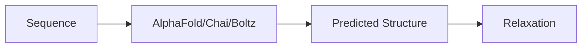
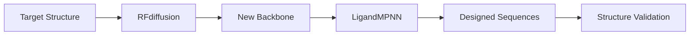
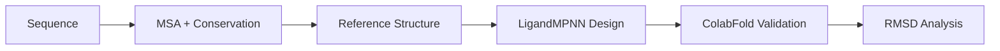

# Protein Engineering

This section covers computational tools and workflows for protein structure prediction, protein design, and molecular docking.

<Note>
  **Siegel Lab users:** The example scripts in this section use Siegel Lab accounts and file paths on UC Davis HIVE. See the [Siegel Lab HPC Guide](/hpc/uc-davis/using-hive/siegel-lab) for account configuration.
</Note>

## Structure Prediction

Predict 3D structures from sequences using state-of-the-art deep learning models.

<CardGroup cols={2}>
  <Card title="AlphaFold 3" icon="cube" href="/protein-engineering/structure-prediction/alphafold3">
    Predict structures of proteins, nucleic acids, and small molecule complexes
  </Card>
  <Card title="AlphaFold 2 / ColabFold" icon="cubes" href="/protein-engineering/structure-prediction/alphafold2">
    Fast structure prediction with ColabFold and template-based AF2
  </Card>
  <Card title="Chai" icon="flask" href="/protein-engineering/structure-prediction/chai">
    Multi-modal structure prediction from Chai Discovery
  </Card>
  <Card title="Boltz2" icon="bolt" href="/protein-engineering/structure-prediction/boltz2">
    Fast biomolecular structure prediction with YAML input
  </Card>
</CardGroup>

## Protein Design

Design new protein sequences and structures with machine learning.

<CardGroup cols={2}>
  <Card title="LigandMPNN" icon="pencil" href="/protein-engineering/design/ligandmpnn">
    Structure-conditioned sequence design with ligand awareness
  </Card>
  <Card title="RFdiffusion" icon="wand-magic-sparkles" href="/protein-engineering/design/rf-diffusion">
    De novo protein backbone generation using diffusion
  </Card>
  <Card title="Design Pipeline" icon="diagram-project" href="/protein-engineering/design/design-pipeline">
    Automated workflow: conservation analysis → design → validation
  </Card>
</CardGroup>

## Molecular Docking

Dock ligands and refine protein structures with Rosetta.

<CardGroup cols={2}>
  <Card title="GALigandDock" icon="bullseye" href="/protein-engineering/docking/rosetta-galigand">
    Protein-ligand docking with genetic algorithm sampling
  </Card>
  <Card title="Relaxation" icon="minimize" href="/protein-engineering/docking/relaxation">
    Energy minimization and structure refinement
  </Card>
</CardGroup>

## Typical Workflows

### Structure Prediction

### Protein Design

### Complete Design Pipeline

